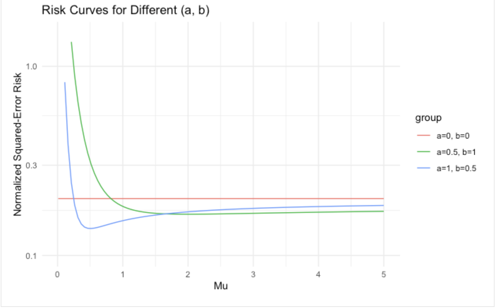
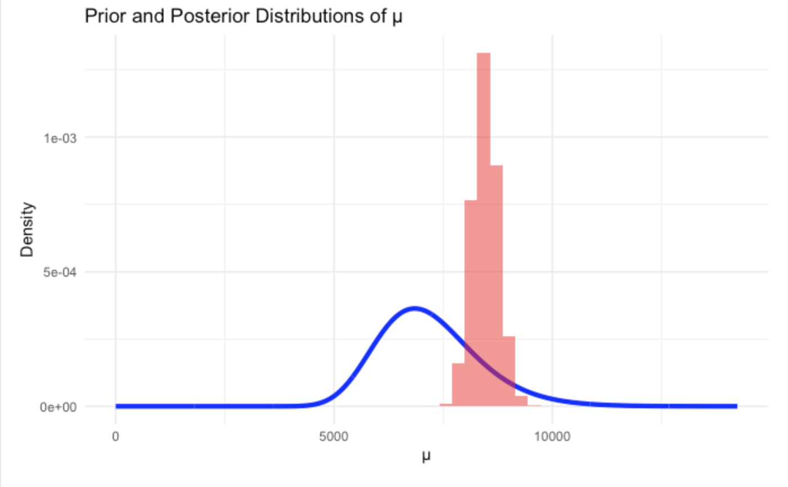
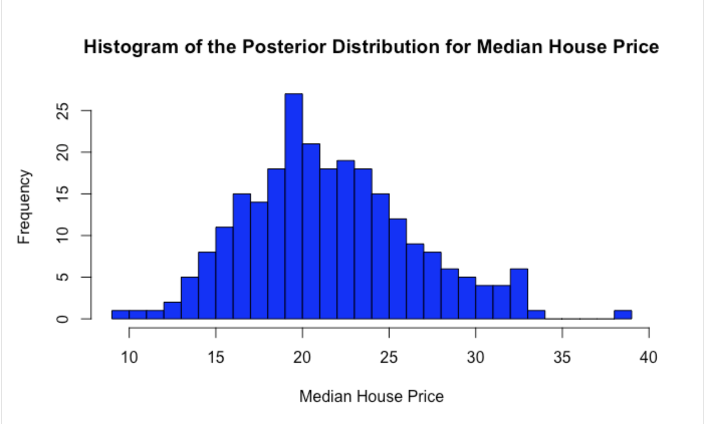
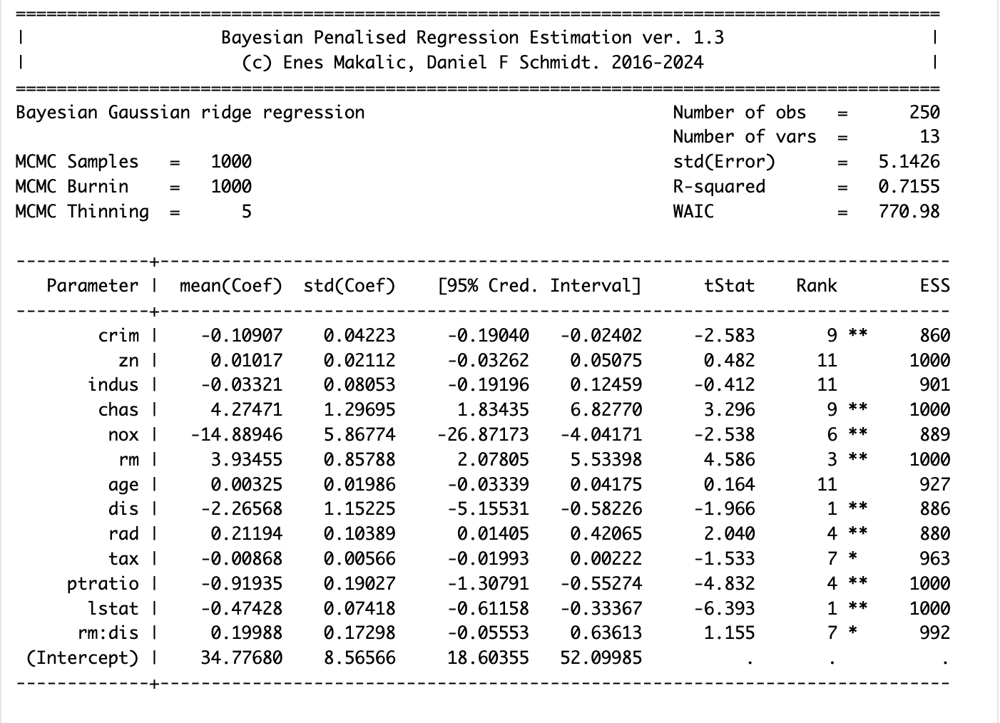

# 🏠 Bayesian Analysis of COVID-19 Cases and Housing Data

This repository contains my R code and statistical analysis for a FIT3154 assignment, covering Bayesian estimation, gamma modelling, posterior inference, and Bayesian regression.

The project is divided into two main applications:
- modelling daily COVID-19 case numbers using gamma-based methods and Bayesian inference
- analysing housing prices using classical linear regression and Bayesian penalised regression

---

## 📌 Introduction

This project explores how Bayesian methods can be applied to real-world datasets in different contexts. The first part focuses on daily COVID-19 case data, where gamma models and prior-posterior analysis are used to estimate average case counts and assess uncertainty. The second part applies regression methods to housing data to examine factors associated with median house prices.

The analysis combines theoretical statistical ideas with practical implementation in R, including risk functions, posterior sampling, credible intervals, Bayesian Lasso, and Bayesian Gaussian ridge regression.

---

## 💡 Motivation

Bayesian methods are useful because they allow us to combine prior beliefs with observed data and quantify uncertainty more directly than standard point estimates alone. In this project, I wanted to explore how these ideas work across different types of problems.

Using COVID-19 case data helps demonstrate Bayesian estimation and posterior inference for positive-valued observations, while the housing dataset provides a good setting for comparing ordinary least squares with Bayesian penalised regression. Together, these tasks show how Bayesian techniques can support both inference and prediction.

---

## 📊 Key Visualisations

### 1. Risk Curves for Different \((a, b)\)



This figure shows how the normalized squared-error risk changes for different prior parameter choices. It highlights how the selection of prior hyperparameters can affect estimator behaviour across different values of \(\mu\).

### 2. Prior and Posterior Distributions of μ



This visual compares the prior distribution with the posterior distribution for the mean daily COVID-19 cases. The posterior becomes much more concentrated after observing the data, showing how the evidence updates prior beliefs.

### 3. Posterior Distribution for Median House Price



This histogram displays simulated posterior samples for the predicted median house price. It provides a useful way to interpret uncertainty in the prediction rather than relying only on a single estimated value.

### 4. Bayesian Gaussian Ridge Regression Output



This summary output presents the Bayesian Gaussian ridge regression model, including posterior coefficient means, standard deviations, credible intervals, and ranking statistics. It helps identify which housing predictors have the strongest associations with median house value.

---

## 🔍 Project Highlights

- Derived and visualised normalized squared-error risk under different prior settings
- Fitted a gamma model to daily COVID-19 case data
- Estimated confidence intervals and conducted hypothesis testing for mean daily cases
- Built prior and posterior distributions for Bayesian inference
- Calculated posterior mean and credible intervals
- Evaluated gamma model fit using empirical and predicted quantiles
- Applied ordinary least squares regression to housing data
- Compared least squares results with Bayesian Lasso regression
- Built reduced Bayesian regression models using important predictors
- Generated posterior predictive distributions for housing price estimates
- Explored interaction effects using Bayesian regression

---

## 🧪 Methods Used

### Bayesian and Distributional Analysis
- Gamma maximum likelihood estimation
- Bayesian posterior sampling
- Credible intervals
- Prior-posterior comparison
- Risk function analysis
- Quantile-based model checking

### Regression Models
- Ordinary Least Squares (OLS)
- Bayesian Lasso Regression
- Bayesian Gaussian Ridge Regression
- Reduced regression modelling
- Posterior predictive simulation
- Interaction term analysis

---

## 🛠️ Tools and Libraries

- **R**
- **ggplot2**
- **invgamma**
- **bayesreg**

---

## 📁 Files

- `Assignment1_FIT3154.Rmd` — main R Markdown file containing the full analysis
- `Screenshot 2026-04-10 at 12.48.31 am.png` — risk curves for different prior parameter settings
- `Screenshot 2026-04-10 at 12.48.52 am.png` — prior and posterior distributions of μ
- `Screenshot 2026-04-10 at 12.49.25 am.png` — posterior distribution for median house price
- `Screenshot 2026-04-10 at 12.49.38 am.png` — Bayesian Gaussian ridge regression summary output

You may also include supporting data files and helper scripts in the repository if available, such as:
- `covid.cases.ass1.2024.csv`
- `housing.2024.csv`
- `gamma.fit.R`

---

## ▶️ How to Run the Code

1. Open the `.Rmd` file in **RStudio**
2. Make sure the required datasets and helper scripts are stored in the same working directory
3. Install the required packages if needed
4. Run the code chunks step by step or knit the document

```r
install.packages(c("ggplot2", "invgamma", "bayesreg"))
